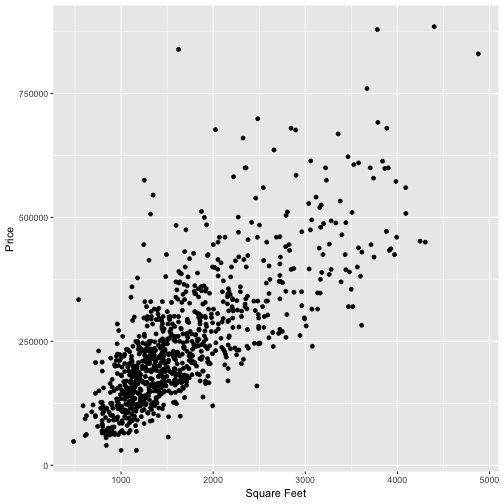
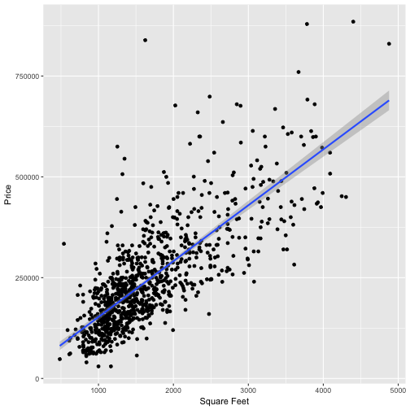

Sacramento Housing Prices
========================================================
author: Scott D. Koenigsman
date: 1/20/17
autosize: true

Overview
========================================================

Sacramento Housing Prices is a Shiny application that allows a user to investigate housing prices based on three factors:

- Number of Bathrooms
- Number of Bedrooms
- Square Feet

User Interface
========================================================

- Use the sliders to select the square footage, number of baths, and number of bedrooms of interest.
- The plot on the 'Output' tab will automatically update to show the ranges of interest
- Check the 'Fit a Linear Model' box to generate a linear model fit for the range of interest.

Output: Plot of Sacramento Housing Prices
========================================================

The 'Output' tab displays a plot of housing prices vs. square footage. 

Data is filtered by min/max values for square footage, number of bedrooms, and number of bathrooms.



Optional Output: Linear Model Fit
========================================================

Checking the 'Fit a Linear Model' box will plot a best fit line and summary of model parameters.



```
              Estimate Std. Error   t value      Pr(>|t|)
(Intercept) 13859.3932 6948.71408  1.994526  4.638609e-02
x             138.5465    3.79628 36.495323 1.111557e-181
```


